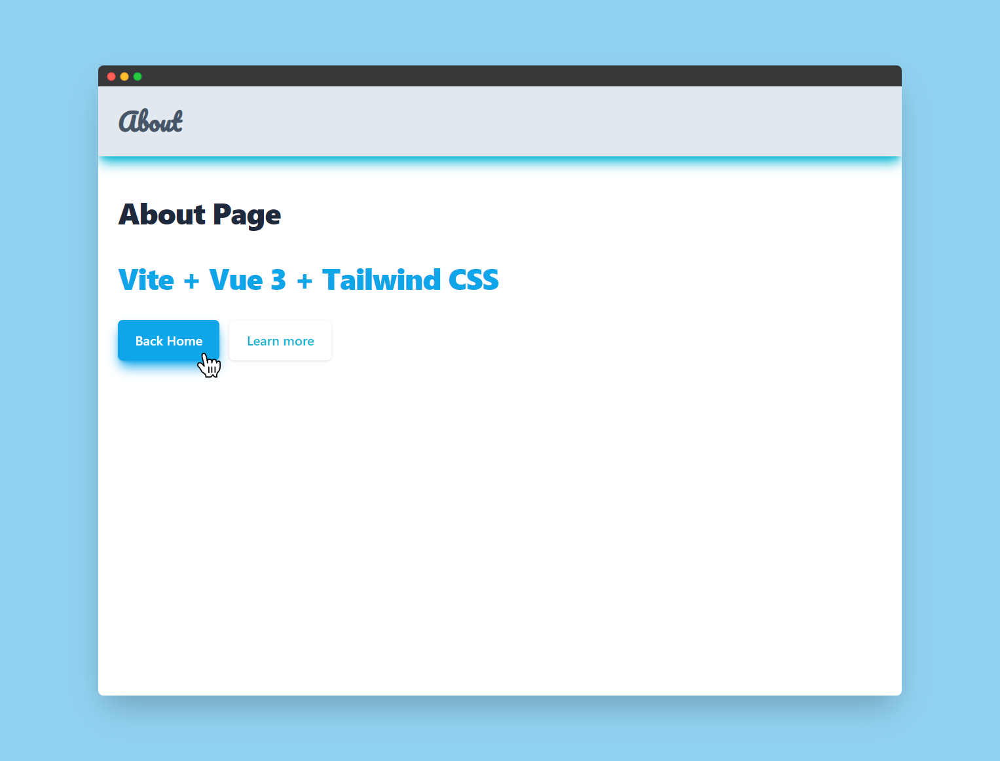

<p align="center">
</img>
</p>

# Frontend Developer

Create a small mobile-only web page section using a JS framework of your choice.


## Demo

[dyeusco.netlify.app](https://dyeusco.netlify.app/)


## Screenshots




## Deployment

This project is deployed on Netlify


## Features

- Live previews
- Fullscreen mode
- Cross platform


## Contributing

Contributions are always welcome!

See `contributing.md` for ways to get started.

Please adhere to this project's `code of conduct`.


## Tech Stack

**Client:** Vue, Vite, TailwindCSS

**Server:** Node


## Run Locally

Clone the project

```bash
  git clone https://github.com/swaubhik/literate-octo-succotash.git
```

Go to the project directory

```bash
  cd my-project
```

Install dependencies

```bash
  npm install
```

Start the server

```bash
  npm run dev
```


## License

<!-- [MIT](https://choosealicense.com/licenses/mit/) -->

[](https://github.com/swaubhik/literate-octo-succotash/blob/master/LICENSE)


## Authors

- [@swaubhik](https://www.github.com/swaubhik)

